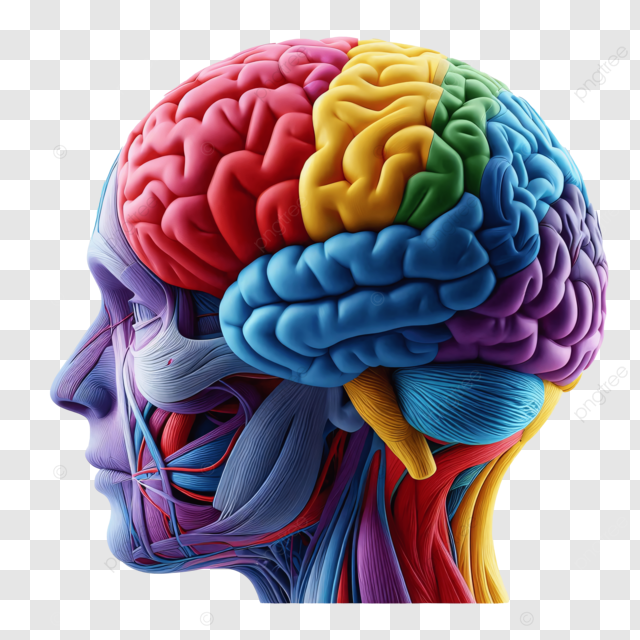

# 🧠 Beyin Duygu Analizi | Streamlit Projesi

Bu proje, kullanıcıdan alınan cümle üzerinden duyguyu analiz eder ve ilgili duygunun beyindeki etkili bölgelerini görselleştirir. Görselleştirmeler, **Plotly** ile beyin haritası üzerine interaktif olarak sunulmuştur.

## 🚀 Özellikler

- Türkçe cümlelerden duygu analizi (BERT tabanlı model + anahtar kelime eşleme)
- Beyindeki bölgeleri, hormonları ve açıklamalarıyla birlikte harita üzerinde gösterme
- Streamlit ile sade ve etkili kullanıcı arayüzü
- Plotly ile dinamik görselleştirme

## 🧠 Kullanılan Teknolojiler

- `Python`
- `Streamlit`
- `Transformers` (Hugging Face `savasy/bert-base-turkish-sentiment-cased`)
- `Plotly`
- `PIL`, `NumPy`

## 📥 Gereksinimler

```bash
pip install streamlit transformers plotly pillow numpy
```

## ⚙️ Nasıl Çalıştırılır?

1. `beyin_streamlit.py` dosyasını indirin.
2. Terminali açıp dosyanın bulunduğu klasöre geçin.
3. Aşağıdaki komutu çalıştırın:

```bash
streamlit run beyin_streamlit.py
```

4. Web arayüzünde bir cümle girin ve "Analiz Et ve Görselleştir" butonuna basın.

> ⚠️ Not: `beyinson.png` görselinin dosya içinde doğru klasörde olduğundan emin olun veya koddaki `gorsel_yolu` satırını düzenleyin.

## 🎯 Örnek Cümleler

- "Bugün çok heyecanlıyım!"
- "Korkuyorum, başıma bir şey gelecek gibi."
- "Neşeliyim ama biraz da özlem var içimde."

## 📌 Duygu Türleri

Projede desteklenen duygular:
`mutluluk`, `stres`, `öfke`, `korku`, `heyecan`, `şaşkınlık`, `üzüntü`, `huzur`, `sevgi`, `özlem`, `neşe`, `motivasyon`

## 👤 Geliştirici

- **GitHub**: [@sudesenoll](https://github.com/sudesenoll)

---

## 📸 Ekran Görüntüsü Önerisi



---

## ➕ Devamında Neler Eklenebilir?

- Farklı dil desteği (İngilizce, Almanca)
- Daha gelişmiş BERT modelleri
- Kullanıcıdan sesli giriş
- Veya chatbot entegrasyonu

---

## ⬇️ Kullanım İzni

MIT Lisansı altında paylaşılabilir ve geliştirilebilir.
